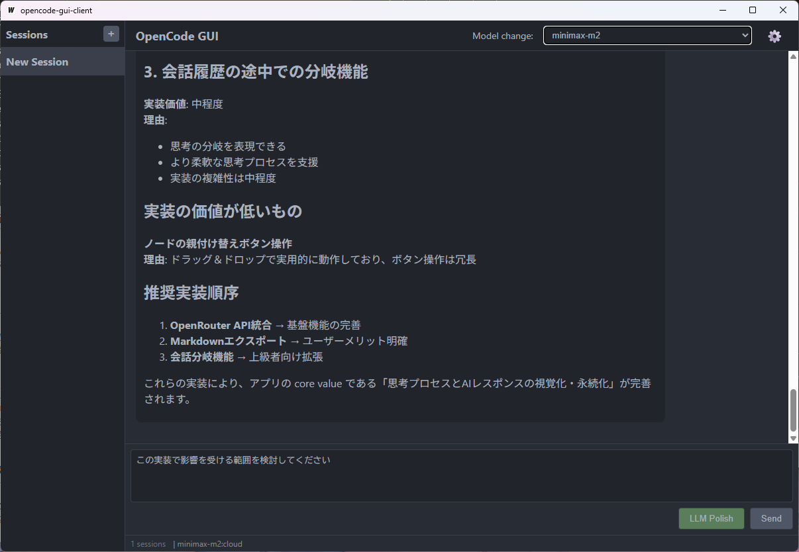
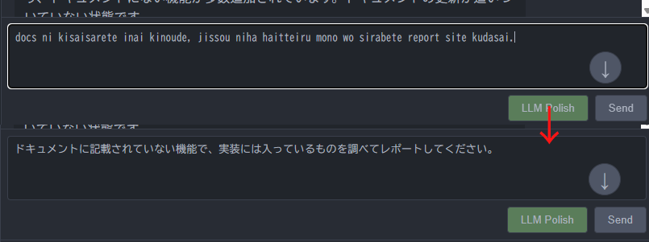

# fm-opencode-tinyapp

<p align="center">
  
</p>

サーバーモードの OpenCode に対しリクエストを送信し操作するための GUI インタフェース。

ターミナル+CLI 環境で非 ASCII 文字（日本語など）を入力すると画面が崩れたりログがたどれなかったりする問題を解決するため、テキスト入力を容易にする GUI サポートツール。

[opencode-web](https://github.com/chris-tse/opencode-web) にインスパイアされています。

## 機能

- OpenCode Server への API 接続と GUI 操作
- セッション管理（作成・切替・削除）
- モデル選択（プロバイダー別にグループ化）
- LLM を利用した文章校正機能
- マークダウンレンダリングとコードシンタックスハイライト

## 構成

**Wails v2** アプリケーション

- バックエンド: Go 1.23
- フロントエンド: React 18 + TypeScript + Vite
- 開発ツール環境: mise で管理

## 前提条件

- [Go](https://go.dev/) 1.23 以上
- [Node.js](https://nodejs.org/) 18 以上
- [Wails CLI](https://wails.io/) v2.10+
  ```bash
  go install github.com/wailsapp/wails/v2/cmd/wails@latest
  ```
- Windows: [Microsoft Edge WebView2 Runtime](https://developer.microsoft.com/en-us/microsoft-edge/webview2/)
- (推奨) [mise](https://mise.jdx.dev/) - 開発環境管理

## 開発環境セットアップ

### mise を使う場合（推奨）

```bash
# 必要なツールをインストール
mise install

# 環境を確認
mise exec -- wails doctor
```

### 手動セットアップ

```bash
# Go と Node.js をインストール後
go install github.com/wailsapp/wails/v2/cmd/wails@latest

# フロントエンド依存関係をインストール
cd frontend
npm install
cd ..

# 環境を確認
wails doctor
```

## ビルド手順

### 開発モード

mise タスクを使用:

```bash
mise run dev
```

### 本番ビルド

```bash
mise run build
```

ビルド成果物は `build/bin/` に生成されます。

## 使い方

opencode は作業するディレクトリでサーバーモードで起動しておきます。

```bash
opencode serve --port (任意)
```

### 1. OpenCode Server への接続設定

1. アプリを起動
2. 設定画面（⚙️ アイコン）を開く
3. 以下を設定:
   - **Server URL**: OpenCode Server のアドレス（例: `http://localhost:8000`）
   - **Provider/Model**: 使用するモデルを選択
   - (オプション) **LLM 設定**: 文章校正用の LLM API 設定（Base URL, API Key, Model, Prompt）
4. 設定後に再起動することで有効になる

### 2. 基本操作

- **メッセージ送信**: `Ctrl+Enter` で送信、`Enter` で改行
- **新規セッション**: サイドバーの "New Session" ボタンまたは `Ctrl+N`
- **セッション切替**: サイドバーのリストから選択
- **モデル変更**: ヘッダーのドロップダウンから選択
- **文章校正**: 入力欄の「推敲」ボタンをクリック

### 3. キーボードショートカット

| キー | 動作 |
|------|------|
| `Ctrl+Enter` | メッセージ送信 |
| `Ctrl+N` | 新規セッション作成 |
| `Ctrl+,` | 設定画面を開く |
| `Escape` | 入力キャンセル |

### 4. LLM polish/入力文章校正機能について

設定で OpenAI API 互換の LLM API key を設定することで、入力中の文章を整形、変換、翻訳させることができます。

当アプリは入力支援をするものですので、入力サポートの一環として付いているオプション機能となります。
API key を設定しなければ動作しないだけですので、利用は任意です。

#### 設定プロンプトについて

プロンプト設定に `{text}` と書くとそこに入力中の文章が埋め込まれます。

1. 文章校正プロンプト

```
下の文章をより自然で分かりやすく、丁寧な表現に修正してください。
誤字脱字や文法的な誤りも修正してください。
修正後の文書のみ出力し、返答などは不要です。
---
{text}
```

2. 半角ローマ字英文混在表記の日本語変換プロンプト

```
あなたは、ローマ字と英語が混在したテキストを自然な日本語に変換する高度な日本語入力システムです。以下のルールに厳密に従ってください。
1.  入力テキストに含まれるローマ字の部分を、文脈に最も適した日本語（ひらがな、カタカナ、漢字）に変換します。
2.  入力テキストに含まれる英単語や英文は、そのまま英語として残します。大文字・小文字も維持してください。
3.  ローマ字入力の多少のタイプミスやスペルミスは、文脈から正しい日本語を推測して自動で修正してください。
4.  変換結果以外の余計な説明、前置き、後書きは一切含めず、変換後の日本語の文章のみを出力してください。
5.  入力が空の場合は、何も出力しないでください。
---
{text}
```

[rerofumi/fm-japanese-input](https://github.com/rerofumi/fm-japanese-input) と同じ効果を持たせることができるようになります。
全角入力モードに切り替えることなくアルファベット入力だけでアルファベットと日本語混在文での指示が入力できるようになります。

<p align="center">
  
</p>


### 5. 設定ファイルについて

- 設定ファイルは config dir の `opencode-gui-client/config.json` に保存されます
  - Windows の場合 `%USERPROFILE%\AppData\Roaming\opencode-gui-client\config.json`
  - macOS の場合 `~/Library/Application Support/opencode-gui-client/config.json`
  - Linux の場合 `~/.config/opencode-gui-client/config.json`
- 設定ファイルは暗号化されていませんので、API key が平文で書かれています。取り扱いにご注意ください。

## ライセンス

このプロジェクトは MIT ライセンスの下で公開されています。

## 作者

**rerofumi** - [GitHub](https://github.com/rerofumi) - rero2@yuumu.org

## 参考

- [OpenCode](https://github.com/stackblitz/opencode) - AI-powered coding assistant
- [opencode-web](https://github.com/chris-tse/opencode-web) - Web UI for OpenCode (Inspiration)

